## Hello, I'm Kawiggles

I'm a computer enthusiast who's recently picked up coding as a hobby. I love figuring out architecture and systems, so anything close to hardware or fundamental to a broader architecture fascinates me. 

---
## Background
During the course of earning my degree in philosophy, I took a particular interest in logic and philosophy of language. The skills of understanding and working with abstract logical systems like those developed by [Gottlob Frege](https://en.wikipedia.org/wiki/Gottlob_Frege) and [Ludwig Wittgenstein](https://en.wikipedia.org/wiki/Ludwig_Wittgenstein) translate fairly directly to computer science. My interest in understanding how systems fundamentally work was a great catalyst in my eventual interest in computers

I originally got into computers through building them. I've been maintaining a personal server running debian, on which I run a variety of open source services. You can find the dotfiles for it in my dotfiles repo, under the great-eastern branch. My interest in server software and infrastracture led me to start learning programming. I started learning with C and C++, which helped me to learn the fundamentals of programming and the nature of various programming paradigms. I eventually switched to primarily using Rust and Go because of their various strengths in backend and systems programming. 

I currently work as an IT Help Desk tech after having spent some time interning with a small IT department. I have passed CompTia A+ and am working on Network+, Security+, and Linux+ to compliment my skill-building in programming.

## My Projects
I am currently working on three major projects, though I tend to switch between projects rapidly as I find new things to learn.

The first is a game engine which I've been using to build up my skill in C++. It runs the core logic of a game, with endpoints for interfacing with an eventual graphics engine, probably unreal engine. It is currently "rendered" using ncurses. I have plans to port the system to Rust in order to make use of the language's strengths in ASTs. 

In order to help the design of that AST structure, my second major project has been building a database in Rust. After reading through *The Rust Programming Language*, I chose this project as a way to get more familiar with low level programming patterns and the Rust language as a whole. It started as a basic key-value store in memory, but I am working on implementing a B+ tree, serializing the tree to memory, and creating an API that correctly parses SQL into ASTs and performing searches with those trees. This project is still in early days.

The third project is a program to help me Get familiar with Go. I'm writing a basic command-line program for creating RSA encryption keys and encrypting files. The project uses the crypto/rand and math/big packages to generate secure random numbers and successfully do math on large integers, but otherwise the encryption algorithm has been entirely written by me. This project is also in its early stages.

## My Language Stats
Obiously an algorithm can't accurately measure language usage, but my most used languages are far and away C and C++. The webdev tools and HTML and CSS are used for my website, which is served using [Nginx](https://github.com/nginx/nginx). As I continue to learn and develop with Go and Rust, these languages will become more represented. It is my intention that these become my primary languages. Lua is heavily used in configuration files for applications like Hyprland and Neovim.

## Development Environment
+ **Operating Systems:** Arch Linux, Debian, Fedora Server, Void Linux
+ **Desktop Environment:** Wayland/[Hyprland](https://github.com/hyprwm/Hyprland)
+ **Terminal Emulator:** [kitty](https://github.com/kovidgoyal/kitty)
+ **Editor:** [Neovim](https://github.com/neovim/neovim) with:
  + [LazyVim](https://github.com/LazyVim/LazyVim)
  + [tree-sitter](https://github.com/tree-sitter/tree-sitter)
  + [nvim-cmp](https://github.com/hrsh7th/nvim-cmp)
  + [nvim-telescope](https://github.com/nvim-telescope/telescope.nvim)
  + [nvim-ufo](https://github.com/kevinhwang91/nvim-ufo)
  + [indent-blankline.nvim](https://github.com/lukas-reineke/indent-blankline.nvim)
<!--
**kawiggles/kawiggles** is a ✨ _special_ ✨ repository because its `README.md` (this file) appears on your GitHub profile.

Here are some ideas to get you started:

- 🔭 I’m currently working on ...
- 🌱 I’m currently learning ...
- 👯 I’m looking to collaborate on ...
- 🤔 I’m looking for help with ...
- 💬 Ask me about ...
- 📫 How to reach me: ...
- 😄 Pronouns: ...
- ⚡ Fun fact: ...
-->
